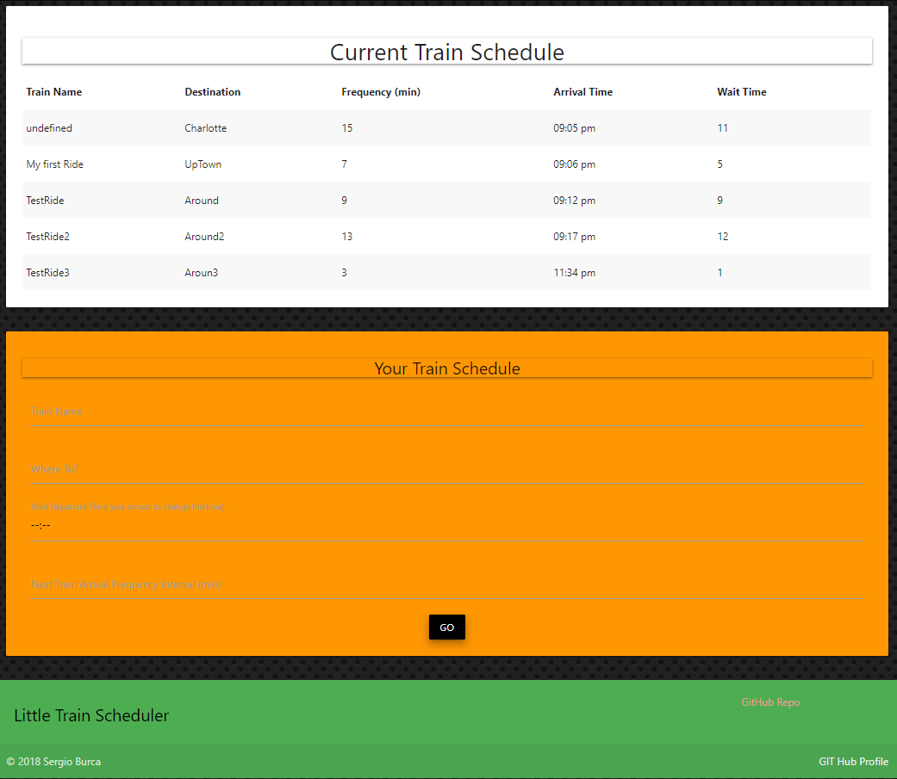

# Train Scheduler
> 
Click  [Scheduler](https://mecaniser.github.io/Train-Scheduler/) to test the app.

## Getting Started
____
> This application was build with a single purpose `to schedule train routes` on user input. Host arrival and departure data on **FireBase**. Time correction and manipulation will be handled by **`Moment.js`**. Visual and UI aspects will be created with __`Materialize`__
### Prerequisites
* **VSC** `installed`
* **`All Content Delivery Networks should be linked`**:
-`Compiled and minified JavaScript`
-`Compiled and minified CSS`
-`Moment.js`
-`Firebase`
-`JQuery`

```
Instructions and Googling a lot !
```


## Running the tests

**`click`** [**`Train`**](https://mecaniser.github.io/Train-Scheduler/) **`link to test the app.`** 

## Built With

* [Materialize](http://materializecss.com/) | `A modern responsive front-end framework` 
* [_Firebase_](https://firebase.google.com/) | `Helps you build better mobile apps and grow your business.`
* [**jQuery**](https://jquery.com/) | `is a fast, small, and feature-rich JavaScript library.`
*  [**Moment~js~**](https://momentjs.com/) | `Parse, validate, manipulate, and display dates and times in JavaScript.`

 
## Authors

> **Sergio Burca** -  - [*GitHub*](https://github.com/mecaniser)

## License

This project is licensed under the MIT License - see the [LICENSE.md](LICENSE.md) file for details
